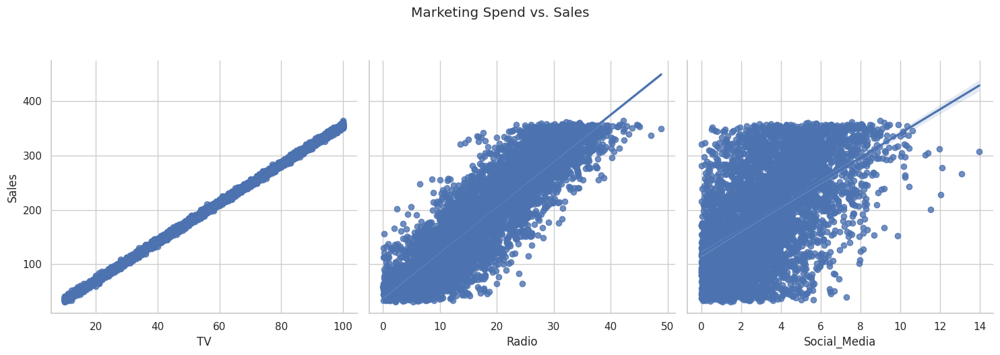
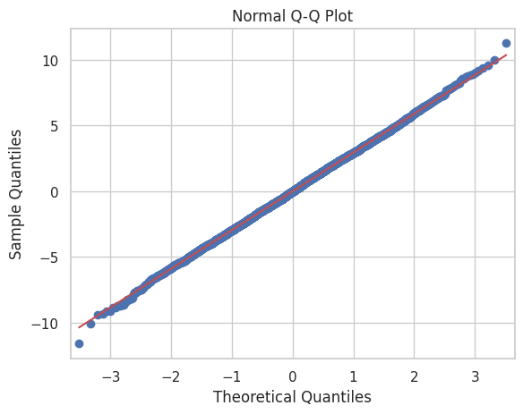
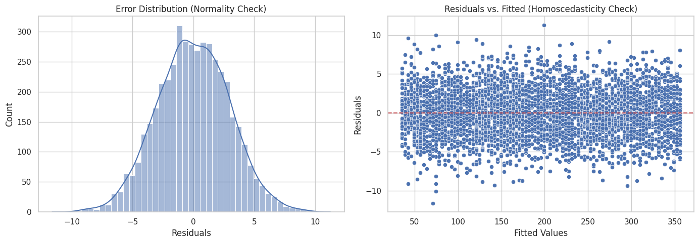

# 3MTT-AI-ML-Project
# Simple Linear Regression – Marketing ROI Analysis

## Project Overview
This project applies Simple Linear Regression using Python and `statsmodels` to analyze a marketing dataset. The objective is to identify which marketing channel (TV, Radio, or Social Media) yields the highest return on investment (ROI) and build a statistically sound model to predict sales outcomes based on budget allocation.

## Key Findings & Business Insights
* **Top Performing Channel:** TV Advertising showed the strongest positive linear correlation ($r = 0.99$) with Sales, visually validated by a perfectly tight distribution pattern during exploratory data analysis.
* **Model Fit ($R^2$):** $99.9\%$ ($R^2 = 0.999$) of the variance in Sales is explained by TV advertising spend, indicating a nearly flawless statistical fit.
* **ROI Impact:** For every 1-unit increase in TV marketing spend, Sales are expected to increase by $3.56$ units ($\beta_1 = 3.5615$), while baseline organic sales when TV spend is zero do not statistically differ from zero ($p = 0.188$).
* **Recommendation:** Reallocate underperforming budgets from Social Media and Radio directly into TV advertising to maximize overall business revenue, as the alternative channels display significant non-linear saturation patterns and high error dispersion.

---

## Statistical Model Validation & Assumption Checking
To satisfy the rigorous technical criteria for Ordinary Least Squares (OLS) regression, the model's underlying mathematical assumptions were explicitly verified using residual diagnostics:

### 1. Feature Selection and Linearity
The pairwise relationships demonstrate an exceptionally tight linear profile for the `TV` variable, while `Radio` and `Social_Media` reveal significant dispersion and variance.



### 2. Normality of Errors (Validated via Normal Q-Q Plot)
The **Normal Q-Q Plot** shows the sample quantiles falling precisely along the $45^\circ$ theoretical reference line with no heavy tails or curvature, validating that the errors are normally distributed ($p\text{-value for Jarque-Bera} = 0.985$).



### 3. Homoscedasticity (Validated via Residuals vs. Fitted Plot)
The **Residuals vs. Fitted Values plot** reveals a uniform, random rectangular cloud of data points evenly distributed around the horizontal zero reference line. The total absence of any funnel, bow-tie, or patterned expansion confirms constant error variance across all predicted sales volumes.



### 4. Independence of Residuals (Validated via Durbin-Watson)
The **Durbin-Watson statistic** yields a value of $1.998$. Being exceptionally close to the ideal benchmark of $2.0$, it mathematically proves the absolute absence of autocorrelation in the error terms.

---

## Environment Setup
To run the Jupyter Notebook locally, ensure you have Python installed, then install the required dependencies:

```bash
pip install pandas numpy matplotlib seaborn statsmodels jupyter
```
